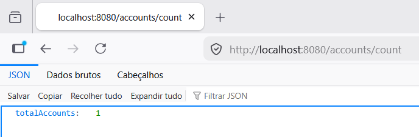
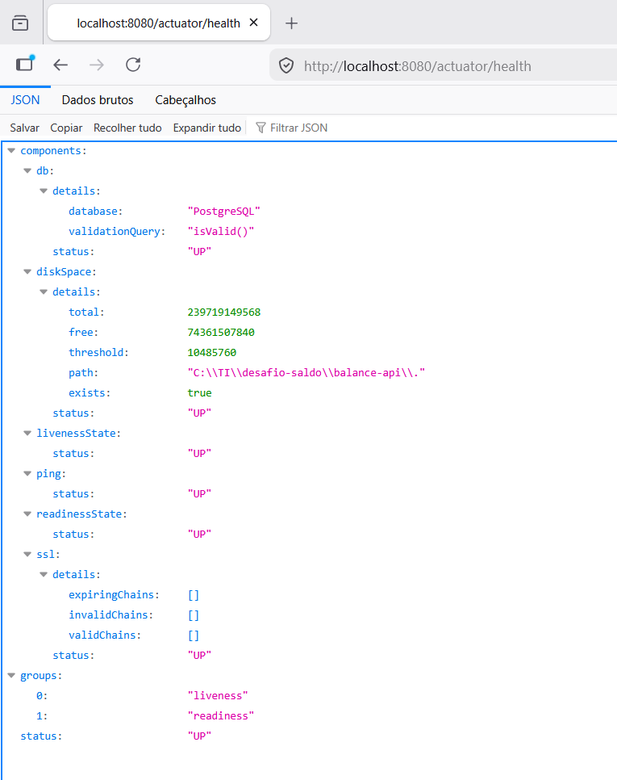
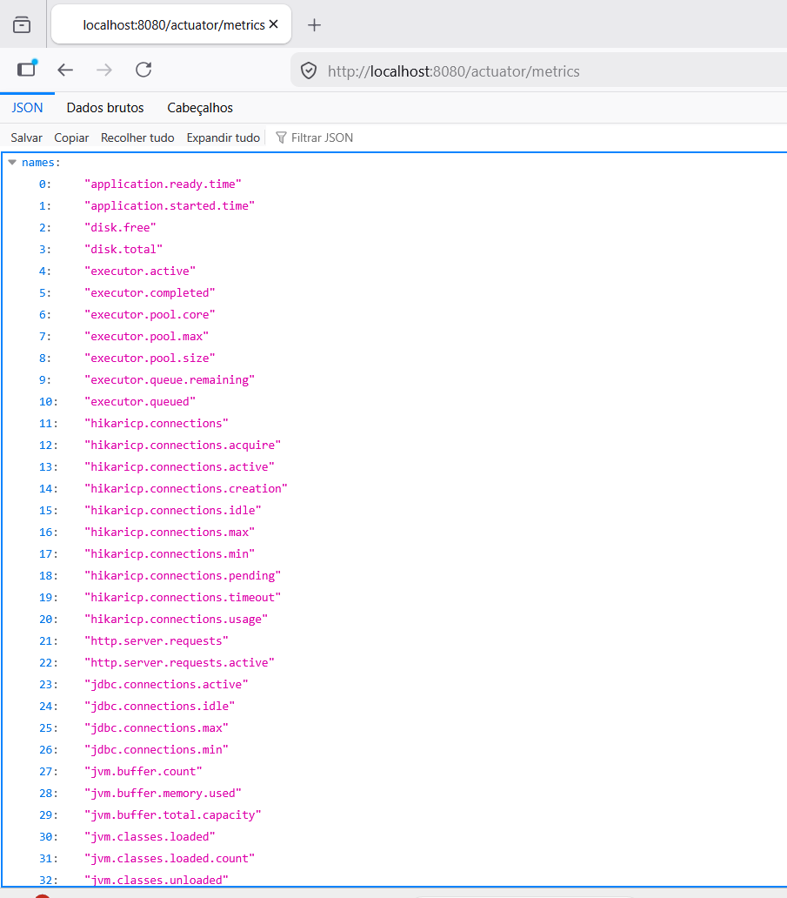

<h1>BALANCE API</h1>

<h4>OBJETIVO:</h4>
Essa API é responsável por receber requisições do Autorizador para fazer atualização de saldo e para devolver consultas com o saldo mais atualizado do cliente.

A solução mantém uma projeção local dos saldos das contas, em Banco de Dados, garantindo a consistência das informações por meio da validação do timestamp da última transação recebida.
  
<h4>ARQUITETURA:</h4>
A aplicação foi desenvolvida utilizando:
- Kotlin
- Spring Boot
- PostgreSQL
- Docker
- Gradle
  

<h4>CAMADAS:</h4>
- Controller: exposição dos endpoints
- Service: regras de negócios
- Repository: acesso aos dados
- Entity: representação das tabelas
- DTO: objetos de entrada e saída
  

<h4>ARQUITETURA ALVO</h4>:
O desenho (drawio) está com a arquitetura ideal, com filas, retry e DLQ.
Nessa versão do projeto, a implementação ainda não possui essa inteligencia de tratamento de eventos com erro.

  
<h4>COMO EXECUTAR:</h4>
1) Abrir o docker e executar o 'desafio-saldo'
2) Subir o postgreSQL pelo gitbash (docker compose up -d postgres)
3) Abrir o intellij e executar o BalanceApiApplication

<h4>ENDPOINTS</h4>

1) Consulta de saldo:  
GET /balances/{accountid}   

 
2) Processar evento:  
POST  /balances/events  
JSON:  

Execução via gitbash:   curl -X POST http://localhost:8080/balances/events -H "Content-Type: application/json" --data @evento.json

3) Contagem de registros no banco:  
GET account/count 

   
<h4>REGRAS DE NEGÓCIOS:</h4> 
- Eventos mais antigos não sobrescrevem eventos existentes mais recentes (regra feita por timestamp)
- Contas inexistentes na base de saldo são criadas automaticamente ao receber um evento válido
  

<h4>OBSERVABILIDADE: </h4>
Spring Boot Actuator habilitado.  
Endpoints disponíveis:
- /actuator/health 
  
- /actuator/metrics  
  
  

<h4>LOGS:</h4> Adicionamos no console logs para recebimento de eventos, criação de contas, atualização de saldos e rejeição de eventos com datas antigas
  
  <h4>TESTES:</h4> Implementados testes unitários para:
1) Conta inexistente;
2) Evento antigo não atualizar o saldo;
3) Evento novo atualizar o saldo.
  

<h4>MELHORIAS FUTURAS:</h4>
- Consumo direto via SQS
- Retry
- DLQ
- Métricas
- Reprocessar mensagens perdidas

  
<h4>DECISÕES TÉCNICAS:</h4>
- Optamos por utilizar o POSTGRESQL ao invés de um banco NoSQL. Por ser um sistema crítico, e seguindo a referência (teorema CAP e ACID/BASE), um sistema de Contas deve ser Consistente e ter Tolerância - não podemos ter uma consistencia eventual... nesse sentido, o Postgresql atende melhor ao que precisamos.
- Por ter volume alto e ser sistema crítico, optamos por utilizar ECS ao invés de Lambda (possível problema de coldstart, embora possa ser contornado com algumas estratégias)
- Utilizamos o timestamp para garantir que transações antigas liberadas pelo Autorizador nãp sobrescrevam o saldo correto do cliente 
- O projeto está utilizando o Hibernate, então as tabelas são criadas de acordo com o nosso projeto. No ambiente do banco, entendemos que essa forma não funcionaria - pois existem processo específicos de governança para criação/atualização de tabelas
- Uso do Spring Boot Actuator para observabilidade
- Separação do projeto em camadas: Controller, Service e Repository
- Implementamos logs para rastreabilidade local. Para o ambiente de produção, o local e o volume dos logs precisará ser revisto.
  

<h4>OBSERVAÇÕES: </h4>
Embora o desenho da arquitetura considere o consumo via fila SQS, o projeto está adaptado para simular local os eventos chegando por POST.
O arquivo dockercompose enviado no desafio, gera a fila CONTA-BANCARIA-CRIADA, que somente cria as contas - e não simula o Autorizador.

A lógica de processamento está correta (validar e só aceitar atualizações de saldo com data recente), porém, para entrar em ambiente de produção, seria necessário adaptar/validar a leitura dos eventos corretamente.
 
